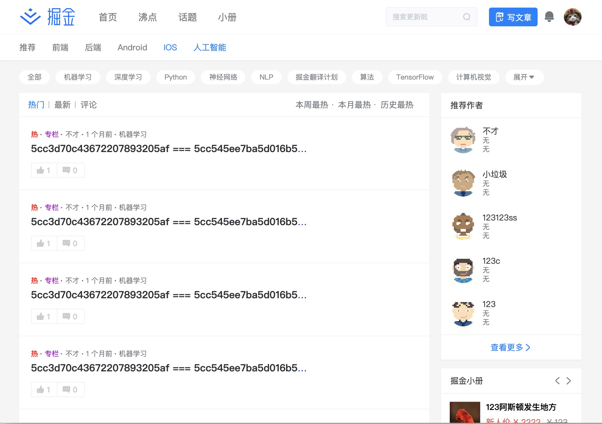

# juejin

> 仿掘金 


> `基于Nuxt.js `


> `技术栈`   
> koa + koa-route + koa-session2 + radis + mongodb  
> Nuxt.js + axios + moment


> `目前完成的功能简介  `
> 分栏目到第三级、评论嵌套、登陆注册、文章排序、点赞评论、信息展示、无限滚动


> `未完成 （总）`  
>  发表文章、搜索、用户详情、密码重置      
> 【沸点、话题、小册、等】

## 展示




## Build Setup

``` bash
# install dependencies
$ npm install

# serve with hot reload at localhost:3000
$ npm run dev

# build for production and launch server
$ npm run build
$ npm start

# generate static project
$ npm run generate
```

For detailed explanation on how things work, checkout [Nuxt.js docs](https://nuxtjs.org).
